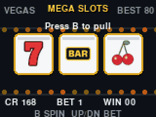
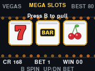
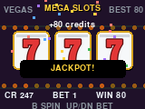
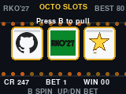

# Octocat Slots 🎰

A GitHub-themed slot machine for the badge. Spin three reels, match symbols,
and keep your credit balance climbing.



| Casino theme (default) | Jackpot! | GitHub theme |
| --- | --- | --- |
|  |  |  |

## Controls

| Button | Action |
| --- | --- |
| **B** or **A** | Spin the reels (costs 1 credit) |
| **UP** | Raise your bet (while idle) |
| **DOWN** | Lower your bet (while idle) |
| **C** | Refill credits when you reach zero |
| **A + B + C** (held together) | Toggle the reel theme — see the Easter egg below |

## Payouts

Outcomes are weighted for a fun-but-fair curve: roughly **4% jackpot**
(three of a kind), **16% pair**, and **80% losing** spins. Three-of-a-kind pays
by symbol rarity; pairs pay a smaller amount. Your best single win is tracked
as a persistent high score.

## Configuration — `conf.py`

Edit `conf.py` on the badge (or toggle in-game) to change how the machine looks
and pays out:

```python
RKO = 0   # reel theme
WIN = 1   # payout table
```

| Option | Value | Effect |
| --- | --- | --- |
| `RKO` | `0` | **Classic casino** reels: 7, BAR, cherry, GitHub, bell, lemon *(default)* |
| `RKO` | `1` | **GitHub** reels: octocat, RKO'27, star, merge, fork, GitHub mark |
| `WIN` | `1` | **Boosted** payouts — credits trend upward over a long session *(default)* |
| `WIN` | `0` | **Original** tighter payouts |

Both themes share the same payout table (six symbols, indexed best-first), so
switching themes never changes the odds — only the artwork.

## Easter egg — live theme switch

Hold **A + B + C** at the same time during play to flip between the casino and
GitHub reel themes instantly. The choice is written back to `conf.py`, so it
sticks the next time you launch the app.

## Files

| File | Purpose |
| --- | --- |
| `__init__.py` | Game logic, themes, config, and rendering |
| `conf.py` | `RKO` / `WIN` options (also rewritten by the A+B+C toggle) |
| `icon.png` | 24×24 menu icon |
| `assets/symbols.png` | GitHub-theme reel sprite sheet (six 32×32 cells) |
| `assets/symbols_casino.png` | Casino-theme reel sprite sheet (six 32×32 cells) |
